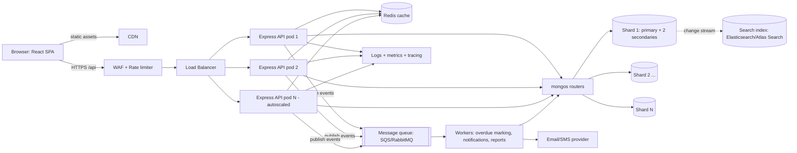

# ShelfLife — Product Requirements Document (Agent Build Spec)

> **Audience:** an autonomous coding agent. Build everything described here, in the order given in §12. Where this document gives a decision, follow it; do not ask for clarification. Where something is marked **OPTIONAL**, build it only after all required items pass the checklist in §13.

---

## 0. Understanding the assignment (read first)

This is a three-part college assessment (50 marks total) for a library management platform called **ShelfLife**.

| Section | Marks | What is really being tested |
|---|---|---|
| A. Backend (Node, Express, MongoDB) | 20 | Schema design, REST CRUD, **atomic stock updates**, JWT auth, middleware, clean folder structure |
| B. Frontend (React + TypeScript) | 20 | Strict typing, typed API client, data fetching with loading/error states, forms, generic components, protected routes |
| C. System Design | 10 | Reasoning at scale: caching, sharding, concurrency, elasticity. **Written answer + diagram, no code** |

**The three ideas the grader is looking for:**
1. **Concurrency safety**: issuing a book must use an atomic conditional update (`findOneAndUpdate` with `availableCopies: { $gt: 0 }` and `$inc: -1`), never read-then-write. Appears in A(e) and C(d).
2. **Type fidelity**: frontend types mirror backend schemas; the API client is generic and typed; at least one generic component (`DataTable<T>`).
3. **Justified design choices**: every system design answer needs a *why* and a comparison to alternatives.

**Deliverables checklist (from the brief):**
- Express app with `routes / controllers / models / middleware` folders
- Backend README: setup + API list
- Sample requests (curl **and** a Postman collection) for every endpoint
- React + TS project (Vite) with component folder structure
- Short note on state-management choice
- 1–2 page system design write-up with a labeled architecture diagram

---

## 1. Repository layout

Single monorepo:

```
shelflife/
├── README.md                  # top-level: overview, how to run both apps
├── backend/
├── frontend/
└── docs/
    ├── system-design.md       # Section C answer (1–2 pages)
    ├── architecture.mmd       # Mermaid source of diagram
    ├── architecture.png       # exported diagram (render via mermaid-cli if network allows; else keep .mmd + ASCII in md)
    ├── state-management-note.md
    └── postman/ShelfLife.postman_collection.json
```

---

## 2. Backend (Section A)

### 2.1 Stack (fixed)

- Node.js ≥ 18, **Express 4**, **Mongoose 8**, MongoDB (local or Atlas)
- **Zod** for input validation
- **jsonwebtoken** + **bcryptjs** for auth
- **morgan** for request logging (plus a request-id)
- **dotenv**, **cors**, **helmet**
- Dev: **nodemon**; Tests (recommended): **jest + supertest + mongodb-memory-server**
- Plain JavaScript (CommonJS) is acceptable; TypeScript is optional. Keep it consistent.

### 2.2 Folder structure

```
backend/
├── package.json
├── .env.example
├── README.md
├── src/
│   ├── server.js              # connects DB, starts app
│   ├── app.js                 # builds express app, mounts middleware + routes
│   ├── config/
│   │   ├── db.js
│   │   └── env.js             # validates required env vars at boot
│   ├── models/
│   │   ├── Book.js
│   │   ├── Member.js
│   │   ├── BorrowRecord.js
│   │   └── Librarian.js
│   ├── routes/
│   │   ├── index.js           # mounts all routers under /api
│   │   ├── auth.routes.js
│   │   ├── book.routes.js
│   │   ├── member.routes.js
│   │   └── borrow.routes.js
│   ├── controllers/
│   │   ├── auth.controller.js
│   │   ├── book.controller.js
│   │   ├── member.controller.js
│   │   └── borrow.controller.js
│   ├── middleware/
│   │   ├── auth.js            # JWT verify → req.user
│   │   ├── validate.js        # zod wrapper (body/query/params)
│   │   ├── requestLogger.js
│   │   ├── notFound.js
│   │   └── errorHandler.js
│   ├── validators/            # zod schemas per resource
│   │   ├── auth.schema.js
│   │   ├── book.schema.js
│   │   ├── member.schema.js
│   │   └── borrow.schema.js
│   ├── utils/
│   │   ├── ApiError.js
│   │   ├── asyncHandler.js
│   │   └── dates.js           # addDays helper, overdue helper
│   └── scripts/
│       └── seed.js            # seeds librarian, books, members
├── tests/
│   └── borrow.concurrency.test.js
└── requests/
    ├── curl.sh                # runnable curl walkthrough for every endpoint
    └── (postman collection lives in /docs/postman)
```

### 2.3 Environment variables (`.env.example`)

```
PORT=5000
MONGO_URI=mongodb://127.0.0.1:27017/shelflife
JWT_SECRET=change-me-to-a-long-random-string
JWT_EXPIRES_IN=8h
LOAN_PERIOD_DAYS=14
CORS_ORIGIN=http://localhost:5173
NODE_ENV=development
```
`config/env.js` must fail fast with a clear message if `MONGO_URI` or `JWT_SECRET` is missing.

### 2.4 Schemas (Q1a)

**Book**
| Field | Type | Rules |
|---|---|---|
| title | String | required, trim, 1–200 chars |
| author | String | required, trim |
| isbn | String | required, **unique**, trim; validate as ISBN-10 or ISBN-13 after stripping hyphens |
| genre | String | required, trim, indexed |
| totalCopies | Number | required, integer, min 1 |
| availableCopies | Number | required, integer, **min 0**, must be ≤ totalCopies (custom validator); defaults to `totalCopies` on create |
| timestamps | | `createdAt`, `updatedAt` |

Indexes: `{ isbn: 1 }` unique, `{ genre: 1 }`, text index on `title` (for search).

**Member**
| Field | Type | Rules |
|---|---|---|
| name | String | required, trim, 2–100 chars |
| email | String | required, **unique**, lowercase, trim, regex email validation |
| membershipId | String | required, **unique**; auto-generated if not supplied, format `MEM-` + 6 digits/alphanumerics |
| joinedDate | Date | default `Date.now` |

**BorrowRecord**
| Field | Type | Rules |
|---|---|---|
| book | ObjectId ref `Book` | required, indexed |
| member | ObjectId ref `Member` | required, indexed |
| issueDate | Date | required, default now |
| dueDate | Date | required; default `issueDate + LOAN_PERIOD_DAYS` |
| returnDate | Date | default `null` |
| status | String enum `issued \| returned \| overdue` | default `issued` |
| issuedBy | ObjectId ref `Librarian` | required (audit trail) |

Indexes: `{ member: 1, issueDate: -1 }` (history query), `{ book: 1, status: 1 }`.
Also add a **partial unique index** to stop the same member holding two active loans of the same book: `{ book: 1, member: 1 }` unique where `status` is `issued` or `overdue`.

**Librarian** (required to support auth in Q1d): `name`, `email` (unique), `passwordHash` (`select: false`), `role` default `"librarian"`.

**Overdue handling (decision):** `status` is stored, but "overdue" is **derived at read time** as well. Implement a Mongoose `toJSON` transform/virtual `effectiveStatus`: if `status === "issued"` and `dueDate < now` → `"overdue"`. Additionally, on `GET /members/:id/history` run a lightweight `updateMany` that flips stored `issued` → `overdue` where `dueDate < now` for that member, so the stored status eventually matches. (A cron job is the production approach; mention it in README.)

### 2.5 API specification (Q1b, Q1d)

Base path: `/api`. All responses are JSON. Success envelope: `{ "success": true, "data": ..., "meta"?: ... }`. Error envelope: `{ "success": false, "error": { "code": "STRING", "message": "Human readable", "details"?: [...] } }`.

| # | Method & path | Auth | Purpose |
|---|---|---|---|
| 1 | `POST /api/auth/login` | public | Issue JWT |
| 2 | `POST /api/books` | **JWT** | Add a book |
| 3 | `GET /api/books` | public | List books (pagination, genre filter, title search) |
| 4 | `POST /api/members` | **JWT** | Register member |
| 5 | `GET /api/members` | **JWT** | List members (needed by frontend Issue form dropdown) |
| 6 | `POST /api/borrow` | **JWT** | Issue a book |
| 7 | `POST /api/return/:borrowId` | **JWT** | Return a book |
| 8 | `GET /api/members/:id/history` | **JWT** | Member's full borrow history |
| 9 | `GET /api/books/genres` | public | Distinct genres (frontend dropdown) |
| 10 | `GET /api/health` | public | Liveness check |

> The brief says only the issue/return routes *must* be protected. Protect all write routes and member data as above; keep book listing public. Document this in the README.

#### 1. `POST /api/auth/login`
Body: `{ "email": string, "password": string }`
- Look up librarian with `passwordHash` selected; `bcrypt.compare`.
- Success `200`: `{ success, data: { token, librarian: { id, name, email } } }`. JWT payload: `{ sub: librarianId, email, role }`, signed with `JWT_SECRET`, expiry `JWT_EXPIRES_IN`.
- Failure `401` `INVALID_CREDENTIALS` (same message for unknown email and wrong password).

#### 2. `POST /api/books`
Body: `{ title, author, isbn, genre, totalCopies, availableCopies? }`
- `availableCopies` defaults to `totalCopies`; reject if greater.
- `201` with created book. Duplicate ISBN → `409 DUPLICATE_KEY` (map Mongo error code 11000 to a friendly message naming the field).

#### 3. `GET /api/books`
Query: `page` (default 1), `limit` (default 10, max 100), `genre` (exact, case-insensitive), `search` (title, case-insensitive substring; escape regex chars), `sort` (default `-createdAt`).
- Response: `{ success, data: [books], meta: { page, limit, total, totalPages, hasNext, hasPrev } }`.
- Use `countDocuments` for total with the same filter; use `.lean()`.

#### 4. `POST /api/members`
Body: `{ name, email, membershipId?, joinedDate? }`
- `201`; duplicate email/membershipId → `409`.

#### 5. `GET /api/members`
Query: `page`, `limit`, `search` (name/email). Same meta format.

#### 6. `POST /api/borrow` — **core logic, must be race-safe**
Body: `{ "bookId": string, "memberId": string, "dueDate"?: ISO string }`
Algorithm (follow exactly):
1. Validate ObjectIds; confirm the member exists (`404 MEMBER_NOT_FOUND`).
2. **Atomically** reserve a copy:
   ```js
   const book = await Book.findOneAndUpdate(
     { _id: bookId, availableCopies: { $gt: 0 } },
     { $inc: { availableCopies: -1 } },
     { new: true }
   );
   ```
3. If `book` is `null`: determine why with a follow-up `Book.exists({_id})` → `404 BOOK_NOT_FOUND` if missing, otherwise `409 NO_COPIES_AVAILABLE`.
4. Create the `BorrowRecord` (`issuedBy = req.user.sub`, `dueDate` default = now + `LOAN_PERIOD_DAYS`).
5. **Compensation:** if record creation throws (including duplicate active loan from the partial unique index), run `Book.updateOne({_id: bookId}, { $inc: { availableCopies: 1 } })` to roll back, then rethrow so the error handler responds (`409 ALREADY_BORROWED` for the duplicate case).
6. `201` with `{ borrowRecord (populated book + member), availableCopies }`.

*(OPTIONAL: wrap steps 2–4 in a Mongo transaction when running on a replica set, controlled by `USE_TRANSACTIONS=true`. Default path remains atomic-update + compensation so it works on standalone Mongo.)*

#### 7. `POST /api/return/:borrowId`
1. Validate id.
2. **Atomically** claim the return so double-submits can't double-increment:
   ```js
   const record = await BorrowRecord.findOneAndUpdate(
     { _id: borrowId, status: { $in: ['issued', 'overdue'] } },
     { $set: { returnDate: new Date(), status: 'returned' } },
     { new: true }
   );
   ```
3. If `null`: `404 BORROW_NOT_FOUND` if the id doesn't exist, else `409 ALREADY_RETURNED`.
4. `Book.updateOne({ _id: record.book, $expr: { $lt: ['$availableCopies', '$totalCopies'] } }, { $inc: { availableCopies: 1 } })` (guard prevents exceeding total).
5. `200` with the updated record. Include `wasLate: boolean` (returnDate > dueDate).

#### 8. `GET /api/members/:id/history`
Query: `status` (optional filter), `page`, `limit` (default 20).
- `404` if member missing. Return records sorted by `issueDate` desc, `populate('book', 'title author isbn genre')`, each with computed `effectiveStatus`. Include the member summary in `meta.member`.

### 2.6 Middleware (Q1c)

1. **requestLogger**: morgan format `:method :url :status :response-time ms` plus a generated `x-request-id` (attached to `req.id` and the response header). Log to console; skip in `NODE_ENV=test`.
2. **validate(schema, source)**: runs Zod `safeParse` on `req.body | req.query | req.params`; on failure respond `400 VALIDATION_ERROR` with `details: [{ path, message }]`; on success replace the source with parsed (coerced) data.
3. **auth (protect)**: read `Authorization: Bearer <token>`; verify; attach `req.user = { sub, email, role }`; `401 UNAUTHENTICATED` for missing/invalid/expired tokens (distinct message for expired).
4. **notFound**: `404 ROUTE_NOT_FOUND`.
5. **errorHandler** (last): handles `ApiError`, `ZodError`, Mongoose `ValidationError` (400), `CastError` (400 invalid id), duplicate key 11000 (409), JWT errors (401), and falls back to 500 with a generic message (stack only when `NODE_ENV=development`). Never leak internals in production.
6. `helmet()`, `cors({ origin: CORS_ORIGIN })`, `express.json({ limit: '100kb' })`.
7. **OPTIONAL:** `express-rate-limit` on `/api/auth/login` (e.g., 10 req/15 min/IP).

### 2.7 Race condition explanation (Q1e) — put verbatim as a comment block above `issueBook` in `borrow.controller.js` **and** in the README

> Two librarians clicking "issue" on the last copy at the same moment could both read `availableCopies = 1`, both pass an `if (> 0)` check, and both decrement, giving -1 and two loans for one copy. A read-then-write is not atomic. To prevent it, I make the check and the decrement a single database operation: `findOneAndUpdate({ _id, availableCopies: { $gt: 0 } }, { $inc: { availableCopies: -1 } })`. MongoDB applies single-document updates atomically, so exactly one request matches the filter and gets the document back; the other gets `null` and is answered with 409 "no copies available". If creating the BorrowRecord fails afterwards, the controller increments the counter back (compensation), or the whole flow runs in a transaction on a replica set. A `min: 0` schema validator and a unique partial index on active loans act as additional safety nets.

### 2.8 Seed script
`npm run seed` creates: 1 librarian (`librarian@shelflife.test` / `Passw0rd!`), ~25 books across ≥ 5 genres (include one book with `totalCopies: 1` for demoing the race), ~8 members, and a few BorrowRecords including **at least two overdue** (dueDate in the past, not returned).

### 2.9 Backend tests (strongly recommended — shows the race fix works)
`borrow.concurrency.test.js`: create a book with `totalCopies: 1`, fire 10 parallel `POST /api/borrow` requests for different members; assert exactly **one** `201`, nine `409`, final `availableCopies === 0`, exactly one active BorrowRecord. Also test: return increments stock, double return → 409, protected route without token → 401, validation errors → 400.

### 2.10 Backend README must contain
Prereqs, install, env setup, run (`npm run dev`, `npm start`), seed, test; table of endpoints (method, path, auth, body, success/error codes); the race-condition note; folder structure explanation; design decisions (overdue derived, compensation vs transactions); curl samples pointer.

### 2.11 Sample requests
- `backend/requests/curl.sh`: a runnable script that logs in, stores `TOKEN`, then exercises **every endpoint** with realistic payloads (including one failing case: issuing an unavailable book).
- `docs/postman/ShelfLife.postman_collection.json`: Postman v2.1 collection with a `baseUrl` variable, a `token` variable auto-set by a login test script, and one request per endpoint.

---

## 3. Frontend (Section B)

### 3.1 Stack (fixed)

- **Vite + React 18 + TypeScript** (`strict: true`, `noUncheckedIndexedAccess: true`)
- **React Router v6**
- **axios** for the API client (typed generics)
- **react-hot-toast** for toasts
- Styling: **Tailwind CSS** (clean, minimal, responsive). No UI kit needed.
- State: **local state + one `AuthContext`** (see §3.9). No Redux/React Query (mention React Query as a considered alternative).
- Lint: eslint + prettier defaults from the Vite template.

### 3.2 Folder structure

```
frontend/
├── .env.example               # VITE_API_URL=http://localhost:5000/api ; VITE_USE_MOCK=false
├── index.html
├── package.json
├── tsconfig.json
├── vite.config.ts
└── src/
    ├── main.tsx
    ├── App.tsx                # router definition
    ├── types/
    │   ├── models.ts          # Book, Member, BorrowRecord, Librarian
    │   └── api.ts             # ApiSuccess<T>, ApiError, Paginated<T>, PageMeta, request DTOs
    ├── api/
    │   ├── client.ts          # axios instance + interceptors
    │   ├── books.ts
    │   ├── members.ts
    │   ├── borrow.ts
    │   ├── auth.ts
    │   └── mock/              # static sample data + mock handlers (used when VITE_USE_MOCK=true)
    ├── context/
    │   └── AuthContext.tsx
    ├── hooks/
    │   ├── useAsync.ts        # generic data-fetching hook (see §3.5)
    │   └── useDebounce.ts
    ├── components/
    │   ├── common/
    │   │   ├── DataTable.tsx  # generic <DataTable<T>>
    │   │   ├── Select.tsx     # generic <Select<T>>
    │   │   ├── Badge.tsx
    │   │   ├── Spinner.tsx
    │   │   ├── ErrorMessage.tsx
    │   │   ├── Pagination.tsx
    │   │   └── Button.tsx
    │   ├── layout/
    │   │   ├── AppLayout.tsx  # navbar + <Outlet/>
    │   │   └── ProtectedRoute.tsx
    │   └── books/BookTable.tsx (optional thin wrappers)
    ├── pages/
    │   ├── LoginPage.tsx
    │   ├── BookListPage.tsx
    │   ├── IssueBookPage.tsx
    │   ├── MemberHistoryPage.tsx
    │   ├── MembersPage.tsx    # list of members linking to history
    │   └── NotFoundPage.tsx
    └── utils/
        ├── date.ts            # formatDate, isOverdue
        └── errors.ts          # getErrorMessage(unknown): string
```

### 3.3 Types and API client (Q2a)

`types/models.ts` (mirror the backend JSON exactly; dates arrive as ISO strings):
```ts
export interface Book {
  _id: string; title: string; author: string; isbn: string; genre: string;
  totalCopies: number; availableCopies: number; createdAt?: string; updatedAt?: string;
}
export interface Member {
  _id: string; name: string; email: string; membershipId: string; joinedDate: string;
}
export type BorrowStatus = 'issued' | 'returned' | 'overdue';
export interface BorrowRecord {
  _id: string;
  book: Book | string;         // populated or id
  member: Member | string;
  issueDate: string; dueDate: string; returnDate: string | null;
  status: BorrowStatus;
  effectiveStatus?: BorrowStatus;
}
```
For history/issue responses, define a narrower `PopulatedBorrowRecord` where `book: Pick<Book,...>` and `member: Member` so components don't need runtime narrowing.

`types/api.ts`: `ApiSuccess<T>`, `Paginated<T> { data: T[]; meta: PageMeta }`, `ApiErrorBody`, request DTOs (`IssueBookRequest { bookId; memberId; dueDate? }`, `LoginRequest`, `LoginResponse`, `BookQuery { page?; limit?; genre?; search? }`).

`api/client.ts`: axios instance with `baseURL = import.meta.env.VITE_API_URL`; request interceptor adds `Authorization: Bearer <token>` from localStorage; response interceptor: on `401` clear token and redirect to `/login`. Export thin typed helpers, e.g. `get<T>(url, params?): Promise<T>` that unwraps the `{success,data}` envelope. Every API function must have an explicit return type, e.g. `export const fetchBooks = (q: BookQuery): Promise<Paginated<Book>>`. **No `any`** anywhere; use `unknown` + narrowing in catch blocks via `getErrorMessage`.

Mock mode: when `VITE_USE_MOCK=true`, API functions resolve from `api/mock` (in-memory arrays with the same shapes, artificial 300–600 ms delay, deliberately-failing 'unavailable' book to demo the error toast). Login in mock mode accepts the seed credentials.

### 3.4 Routing and route protection (Q2f)

```
/login                         → LoginPage (redirect to / if already authed)
/ (ProtectedRoute + AppLayout)
   ├─ index                    → BookListPage
   ├─ issue                    → IssueBookPage
   ├─ members                  → MembersPage
   └─ members/:id/history      → MemberHistoryPage
*                              → NotFoundPage
```
`ProtectedRoute`: if `!token` → `<Navigate to="/login" replace state={{ from: location }} />`; after login, navigate back to `state.from` or `/`. `AuthContext` exposes `{ token, librarian, login(), logout(), isAuthenticated }`; initial state read synchronously from localStorage (avoid flash redirect). Navbar shows librarian name + Logout.

### 3.5 Data fetching approach
Create `useAsync<T>(fn, deps)` returning `{ data, loading, error, reload }` with: cancellation/ignore-stale-response flag (or AbortController) in the effect cleanup, error normalized via `getErrorMessage`. Use it in all list pages. (Rationale to mention in note: mirrors React Query's essentials without the dependency.)

### 3.6 Pages

**BookListPage (Q2b)**
- Table via `DataTable<Book>` with columns: Title, Author, ISBN, Genre, Availability (`available / total`, red text when 0).
- Title search input (**debounced 400 ms** via `useDebounce`) → `search` query param; Genre `Select` (options from `GET /books/genres`, plus "All genres").
- Pagination component using `meta`. Changing filters resets page to 1.
- States: loading (spinner/skeleton rows), error (message + Retry button calling `reload`), empty ("No books match your filters").
- Server-side filtering is the source of truth (don't filter the current page client-side).

**IssueBookPage (Q2c)**
- Two generic `Select`s: Member (`Select<Member>`, label `name (membershipId)`), Book (`Select<Book>`, label `title — available/total`; books with 0 copies shown disabled). Loading of the option lists handled with loading/error states.
- Submit button disabled when: either field empty **or** `submitting`. Show spinner/"Issuing…" text while in flight.
- On success: `toast.success("Issued '<title>' to <name>. Due <date>")`, reset the form, refetch books. On error: `toast.error(message from API)` (e.g., "No copies available").
- Use `try/finally` so `submitting` always resets; guard against double-submit.
- Optionally show a "Due date" preview (today + 14 days).

**MemberHistoryPage (Q2d)**
- Route param `id`; header with member name/email/membershipId; list via `DataTable<PopulatedBorrowRecord>`: Book, Issued, Due, Returned (— if null), Status badge.
- **Badge rules** (via `Badge` component, `utils/date.isOverdue`): overdue if `!returnDate && new Date(dueDate) < today` → **red "Overdue"** badge (also show "X days overdue"); `issued` & not overdue → blue "Issued"; `returned` → green "Returned" (amber "Returned late" if returnDate > dueDate). Don't rely only on the backend's status — compute client-side as the brief requires.
- Include a **Return** button on non-returned rows calling `POST /return/:id` with in-flight disabling and toast, then reload (nice-to-have but included because the API exists).
- Loading, error, empty ("No borrow history yet") states. Handle `404` member (friendly message + link back).

**MembersPage**: searchable table of members with a "View history" link. Plus a small inline "Register member" form (posts to `POST /members`, toast, refresh) — OPTIONAL but cheap.

**LoginPage**: email + password, inline validation, disabled while submitting, error message on failure, redirect on success. Prefill hint of demo credentials in dev mode only.

### 3.7 Reusable generic components (Q2e)

```ts
// DataTable.tsx
export interface Column<T> {
  key: string;
  header: string;
  render: (row: T) => React.ReactNode;
  className?: string;
}
interface DataTableProps<T> {
  columns: Column<T>[];
  rows: T[];
  rowKey: (row: T) => string;
  loading?: boolean;
  emptyMessage?: string;
  onRowClick?: (row: T) => void;
}
export function DataTable<T>(props: DataTableProps<T>): JSX.Element
```
```ts
// Select.tsx
interface SelectProps<T> {
  label: string;
  options: T[];
  value: T | null;
  onChange: (v: T | null) => void;
  getKey: (o: T) => string;
  getLabel: (o: T) => string;
  isOptionDisabled?: (o: T) => boolean;
  placeholder?: string;
  disabled?: boolean;
}
export function Select<T>(props: SelectProps<T>): JSX.Element
```
Both **must be used** with at least two different types (`DataTable<Book>`, `DataTable<PopulatedBorrowRecord>`, `DataTable<Member>`; `Select<Member>`, `Select<Book>`, plus genre `Select<string>`). Demonstrates the generic works across entities.

### 3.8 UX and quality requirements
- Responsive (usable at 375 px width); tables scroll horizontally on small screens.
- Accessible: labels bound to inputs, buttons have text, focus states, `aria-live` on error messages, badges have text not just color.
- No `any`, no `// @ts-ignore`; `npm run build` (tsc + vite) must pass with zero errors; `npm run lint` clean.
- Keep components small; no data-fetching inside generic components.

### 3.9 State-management note (`docs/state-management-note.md`, ~150–200 words)
Content to write: chose **local component state for server data and form state** (each page owns its data via `useAsync`; nothing needs to be shared across distant components), and **a single React Context for auth** (token + librarian are the only truly global state, change rarely, so Context won't cause re-render problems). Rejected Redux/Zustand as overkill for 5 screens; noted **React Query/TanStack Query** as the upgrade path if caching, background refetch, or mutation invalidation became important (and that the `useAsync` hook's interface was shaped to make swapping easy). Mention trade-off: without a cache, navigating back refetches.

### 3.10 Frontend README
Install, env, run (`npm run dev`), build, mock mode toggle, demo credentials, route table, folder structure, link to state-management note.

---

## 4. System Design (Section C) — content for `docs/system-design.md`

Write as a 1–2 page document (~700–1000 words) with headings **(a)–(e)** matching the brief, plus the diagram. State assumptions up front: 500 libraries, 2 M members, 10× peak in semester week; reads (search) dominate writes (issue/return) roughly 20:1 to 50:1. Add a one-line capacity estimate (e.g., normal ≈ 150 req/s mixed, peak ≈ 1,500 req/s; label as assumption).

### (a) Architecture
Include a **Mermaid diagram** (`docs/architecture.mmd`, also embedded in the md and exported to PNG if tooling allows) and a short description of each box:


Components: CDN (React bundle, covers); WAF/rate limiting; L7 load balancer with health checks; stateless Express API (JWT verified locally, so no sticky sessions); Redis; sharded MongoDB with read preference `secondaryPreferred` for catalog reads; queue + workers for async work (overdue sweeps, reminder emails, report generation) kept off the request path; optional search index for fuzzy title search at scale; observability.

### (b) Single cluster vs sharding
Give a reasoned answer: **Start with a replica set (3 nodes) + cache; design the schema now to be shardable; shard when triggers are hit** (working set > RAM of largest sensible node, sustained write throughput near primary limit, or storage > ~2–4 TB). For the exam answer, **commit to sharding for this scale** and propose:
- Add a `libraryId` field to **Book, Member, BorrowRecord** (the original schema lacks it; required for multi-tenancy at 500 libraries).
- **Book shard key:** `{ libraryId: 1, _id: 1 }` (or `{ libraryId: 1, isbn: 1 }`). Justify: almost every catalog/search/issue query is scoped to one library → targeted single-shard queries instead of scatter-gather; `libraryId` alone has low cardinality (500) and risks jumbo chunks for large libraries, so the compound key adds cardinality; `availableCopies` updates for one book always hit one shard, which preserves atomicity.
- **BorrowRecord shard key:** `{ libraryId: 1, member: 1, issueDate: 1 }`? Choose and justify one: recommended `{ libraryId: 1, member: 1 }` with `issueDate` as a tiebreaker/third field. Justify: issue/return are library-scoped, member history is a single-member query (targeted), and the write load spreads across libraries and members. Call out the **trade-off**: "who has this book out?" (`book` lookup) becomes scatter-gather within the library's shard range; mitigated by a secondary index on `{ book, status }` and by the fact that a library's data sits in few chunks.
- Reject monotonically increasing keys (`_id`/timestamp alone) because they create a hot shard; reject `hashed(_id)` for Book because it loses library-scoped targeting. Mention zone sharding to pin large libraries or regions to dedicated shards.
- Also note: Member collection shard key `{ libraryId: 1, membershipId: 1 }` (brief mention).

### (c) Most read-heavy operation + caching
Identify **book catalog search/browse (`GET /api/books` with genre/title filters, paginated)**, since every student browses and the semester-start spike hits this hardest.
- **What to cache:** the serialized response for each normalized query key `books:{libraryId}:{genre}:{search}:{page}:{limit}:{sort}` in Redis (cache-aside). Cache **catalog metadata** (title, author, isbn, genre) separately from **availability**: availability changes on every issue/return, so serve it from a per-book key `avail:{bookId}` (or merge at response time) with a very short TTL.
- **TTL:** metadata/list pages **5 minutes** (+ small random jitter to avoid stampedes); availability **10–15 seconds**; genres list **1 hour**.
- **Invalidation:** on book create/update/delete → delete keys by library/genre tag (maintain a set of keys per `libraryId` or use version-stamped keys: `catalogVersion:{libraryId}` incremented on change, so old keys just expire). On issue/return → update/delete `avail:{bookId}` only (don't blow away the list caches). TTL is the safety net if an invalidation is missed.
- **Stampede protection:** single-flight lock / request coalescing on cache miss; serve-stale-while-revalidate for popular keys. Optionally pre-warm top queries before semester starts. Expected hit ratio and what it does to DB load (state qualitatively, e.g., > 90 %).
- Mention that **issue/return are never served from cache**.

### (d) Never-negative `availableCopies` at scale
Chosen mechanism: **atomic conditional update on the single Book document** (`findOneAndUpdate({_id, availableCopies:{$gt:0}}, {$inc:{availableCopies:-1}})`). Explain why it works across many API pods and shards: the document lives on exactly one shard (shard key includes `libraryId` + `_id`), and MongoDB serializes writes per document, so the guarantee comes from the database, not application code. Compare alternatives:
- **Optimistic locking (version field):** correct but under a last-copy stampede most requests fail and retry, wasting load, whereas the atomic update has no retry loop.
- **Distributed lock (Redis/Redlock):** adds a network hop, a new failure mode (lock expiry mid-operation, clock/GC pauses), and is unnecessary when the DB can enforce the invariant itself.
- **Queue (serialize per book):** gives ordering and smoothing, but adds latency and complexity; keep as an option for extreme hot-title situations (partition the queue by `bookId`) rather than the default.
- **Multi-document transactions:** needed only if record creation and decrement must be all-or-nothing; they cost throughput, so use compensation (increment back on failure) or transactions only on the rare path.
Defense in depth: schema `min: 0`, DB-level validator (`$jsonSchema`: `availableCopies >= 0`), idempotency key on `POST /borrow` (client-supplied `Idempotency-Key` stored with the record, unique index) so retries after timeouts don't double-issue, and a periodic reconciliation job comparing `totalCopies - count(active loans)` to `availableCopies`.

### (e) Handling the 10× spike without year-round over-provisioning
- **Stateless API on Kubernetes/ECS with horizontal autoscaling** (HPA on CPU and requests/sec); **scheduled scaling** to pre-scale ahead of known semester dates (the spike is predictable), with reactive autoscaling as backup. Scale back down afterward.
- **Cache absorbs reads** (the bulk of the spike): pre-warm, raise TTL moderately during peak, CDN for static assets and cacheable public catalog responses.
- **Database elasticity:** managed MongoDB (Atlas) with auto-scaling tiers or temporarily upgraded tier/extra read replicas during semester week; shard only with a shard-count that fits baseline, adding capacity in advance; use secondary reads for catalog.
- **Queue-based load leveling** for non-critical writes (notifications, analytics); keep issue/return synchronous but protected.
- **Protective measures:** per-IP/per-user rate limits, request timeouts, circuit breakers, graceful degradation (e.g., serve slightly stale availability, disable heavy filters/export features), connection pooling limits to protect Mongo.
- **Staggering:** library-specific orientation schedules / virtual waiting room if needed (optional).
- **Validate beforehand:** load test at 10× before each semester (k6/Artillery); define SLOs and alerts.
- Cost framing: pay for peak for ~1–2 weeks per semester instead of 52.

> Close the document with a short table: *Decision → Choice → Main reason → Trade-off*. Keep the whole doc to ~2 pages.

---

## 5. API contract summary (shared source of truth)

Error codes used across backend and frontend: `VALIDATION_ERROR (400)`, `UNAUTHENTICATED (401)`, `INVALID_CREDENTIALS (401)`, `BOOK_NOT_FOUND / MEMBER_NOT_FOUND / BORROW_NOT_FOUND / ROUTE_NOT_FOUND (404)`, `DUPLICATE_KEY (409)`, `NO_COPIES_AVAILABLE (409)`, `ALREADY_BORROWED (409)`, `ALREADY_RETURNED (409)`, `INTERNAL_ERROR (500)`.

Frontend `getErrorMessage` must prefer `error.response.data.error.message`, fall back to network error text, then a generic string.

---

## 6. Non-functional requirements
- **Security:** hashed passwords (bcrypt cost ≥ 10), no secrets committed, `.env` git-ignored, `helmet`, CORS locked to frontend origin, request body size limit, generic auth errors.
- **Code quality:** consistent naming, async handlers wrapped (no unhandled rejections), controllers thin / logic readable, no commented-out dead code, meaningful commit messages if git is used.
- **Docs:** each README must let a new person run the project in under 5 minutes.

---

## 7. Out of scope
Fines/payments, reservations, email sending, multi-tenant admin UI, role management beyond librarian, password reset, file uploads. (System design discusses multi-library scale conceptually; the implemented app is single-library.)

---

## 8. Dependencies to install

Backend: `express mongoose zod jsonwebtoken bcryptjs morgan helmet cors dotenv` · dev: `nodemon jest supertest mongodb-memory-server`
Frontend: `react-router-dom axios react-hot-toast` · dev: `tailwindcss postcss autoprefixer` (+ Vite TS template defaults)

---

## 9. npm scripts

Backend: `dev` (nodemon src/server.js), `start`, `seed`, `test`.
Frontend: `dev`, `build`, `preview`, `lint`.

---

## 10. Definition of done per section

**A:** every endpoint works against a real Mongo; concurrency test passes; auth required where specified; consistent error envelope; README + curl + Postman done; race note present.
**B:** `npm run build` passes with zero TS errors; all five behaviors (a–f) demonstrable; works in both real and mock mode; state note written.
**C:** document answers a–e, includes labeled diagram and justifications with trade-offs.

---

## 11. Agent working rules
1. Build and verify incrementally; run the app/tests after each stage and fix failures before moving on.
2. Do not invent extra features before the checklist is green.
3. If a library version conflict appears, pick the latest stable compatible versions and note it in the README.
4. If Docker/Mongo isn't available in the sandbox, use `mongodb-memory-server` for tests and document how to point `MONGO_URI` at a real instance.
5. Keep the final summary short: what was built, how to run, any deviations.

---

## 12. Build order

1. Scaffold monorepo + backend skeleton (app/server/config/env, error utilities).
2. Models + validators + seed script.
3. Middleware (logger, validate, auth, notFound, errorHandler).
4. Auth route/controller; then books, members, borrow/return, history.
5. Concurrency + integration tests; fix issues.
6. `curl.sh`, Postman collection, backend README (include race note).
7. Scaffold frontend (Vite TS, Tailwind, router), types, API client, mock layer.
8. AuthContext, ProtectedRoute, LoginPage.
9. Generic components (`DataTable`, `Select`, `Badge`, `Pagination`, etc.) and `useAsync`/`useDebounce`.
10. BookListPage → IssueBookPage → MembersPage → MemberHistoryPage.
11. Verify against the real backend; run `build` and `lint`.
12. Write `docs/state-management-note.md`, frontend README, top-level README.
13. Write `docs/system-design.md` + diagram (`.mmd`, embedded Mermaid, PNG if possible).
14. Final pass against §13.

---

## 13. Final acceptance checklist

**Backend**
- [ ] Book/Member/BorrowRecord schemas with validation, unique ISBN/email/membershipId, refs
- [ ] POST/GET `/books` (pagination + genre filter + search), POST `/members`, POST `/borrow`, POST `/return/:borrowId`, GET `/members/:id/history`, POST `/auth/login`
- [ ] Issue decrements atomically and rejects at 0; return increments and sets status/returnDate
- [ ] Logger, validation, centralized error handler middleware
- [ ] JWT protects issue/return (and other write routes)
- [ ] Race-condition explanation (4–6 lines) in code comment and README
- [ ] Folder structure: routes / controllers / models / middleware
- [ ] README with setup + API list; curl script + Postman collection covering every endpoint

**Frontend**
- [ ] Typed models + typed API client, no `any`
- [ ] Book list with title search, genre dropdown, loading + error states
- [ ] Issue form: member + book select, toast on success/error, button disabled while in flight
- [ ] Member history with distinct overdue badge (dueDate < today and not returned)
- [ ] Generic `DataTable<T>` and `Select<T>` used with multiple entity types
- [ ] Route protection redirecting to `/login`
- [ ] State-management note

**System design**
- [ ] (a) architecture + labeled diagram, (b) shard decision + keys + justification, (c) hot read path + cache strategy (what/invalidation/TTL), (d) concurrency mechanism + why over alternatives, (e) spike handling plan
