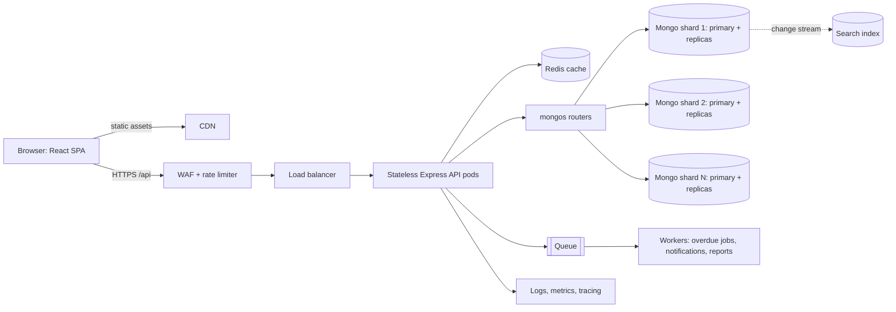

# ShelfLife — System Design Write-Up

## Assumptions

ShelfLife serves 500 campus libraries and roughly 2 million members. Catalog browsing and search dominate issue and return writes by about 30:1. I assume a normal mixed load of 150 requests/second and a predictable semester-week peak of 1,500 requests/second. The implemented application is single-library; `libraryId` below is a production-scale extension.

## (a) High-Level Architecture



The CDN serves the React bundle and other static assets. A WAF and rate limiter protect public endpoints, especially login, before requests reach a load balancer with health checks. Express pods are stateless because JWTs are verified locally, so there are no sticky sessions and horizontal scaling is straightforward. Redis supports cache-aside catalog reads. MongoDB is the source of truth; a queue moves non-critical email, report, and overdue-sweep work off the request path. Workers, traces, metrics, and structured logs make asynchronous failures observable. A dedicated search index is optional when MongoDB substring search is no longer sufficient.

## (b) Single Cluster vs. Sharding

I would begin with a three-node MongoDB replica set plus Redis, but design for sharding and commit to it at this target scale. A replica set is simpler and should be retained until the working set exceeds practical RAM, sustained writes approach primary capacity, or storage reaches roughly 2–4 TB. The 500-library / 2-million-member scenario justifies preparing the shard keys now.

Add `libraryId` to Book, Member, and BorrowRecord. Use `{ libraryId: 1, _id: 1 }` for Book. Almost every catalog and issue request is library-scoped, so this targets one shard. `libraryId` alone has only 500 values and risks jumbo chunks; `_id` adds distribution. The atomic update for one book still executes on one shard.

Use `{ libraryId: 1, member: 1, issueDate: 1 }` for BorrowRecord. Member history queries target the member range and preserve chronological ordering. The trade-off is that “who holds this book?” is not the leading key. A secondary `{ libraryId: 1, book: 1, status: 1 }` index mitigates that query. I reject a timestamp-only key because it creates a hot shard, and hashed Book `_id` because it loses targeted library catalog queries. Zone sharding can place unusually large libraries or regions on dedicated capacity.

## (c) Read-Heavy Operation and Caching

The hottest operation is catalog browsing and search: `GET /api/books?genre=&search=&page=&limit=`. Use Redis cache-aside keys such as `books:{libraryId}:{genre}:{search}:{page}:{limit}:{sort}`. Cache catalog metadata for five minutes with small TTL jitter, genres for one hour, and `avail:{bookId}` separately for 10–15 seconds. Separating availability prevents frequent loans from invalidating every catalog page.

On book creation or edits, increment `catalogVersion:{libraryId}` and include it in future keys. Old pages expire naturally. On issue or return, delete or update only `avail:{bookId}`. Issue and return never trust cache: MongoDB remains authoritative. Use a short Redis single-flight lock on popular cache misses and stale-while-revalidate responses to prevent a cache-expiry stampede. Pre-warming popular pages before semester week should keep the hit rate above 90%.

## (d) Preventing Negative Availability

The selected mechanism is an atomic conditional update on the Book document:

```js
Book.findOneAndUpdate(
  { _id: bookId, availableCopies: { $gt: 0 } },
  { $inc: { availableCopies: -1 } },
  { new: true }
);
```

MongoDB evaluates the condition and decrement as one single-document operation. Across API pods, only requests that observe a positive value inside that update succeed; the first request after the final copy receives `null` and returns HTTP 409. With the proposed shard key, the document remains on one shard, preserving that guarantee.

Optimistic locking is correct but causes avoidable retries during last-copy contention. A Redis distributed lock adds network latency and lock-expiry failure modes when MongoDB already enforces the invariant. A queue can serialize extreme hot-title demand but adds user-visible latency and complexity. A multi-document transaction could make stock and record creation fully atomic, but reduces throughput; this implementation uses compensation to restore stock if BorrowRecord creation fails. Schema `min: 0`, the active-loan partial unique index, and periodic reconciliation provide further defense. **Future enhancement:** idempotency keys can protect clients that retry after a network timeout; they are not currently implemented in this API.

## (e) Handling Semester Spikes

Run stateless APIs on Kubernetes or ECS with horizontal autoscaling based on CPU and requests per second. Since semester dates are known, pre-scale 24 hours before the event and retain reactive autoscaling as backup; scale down afterward rather than paying for peak capacity all year. Redis, pre-warmed catalog keys, and a CDN absorb the read-heavy portion of the spike.

Use managed MongoDB auto-scaling or temporarily increase the cluster tier and secondary read capacity during peak weeks. Keep issue and return synchronous, while queues level notification and report work. Apply per-IP and per-user rate limits, connection-pool limits, request timeouts, and graceful degradation such as temporarily serving slightly stale catalog availability or disabling expensive exports. Before each semester, run a k6 or Artillery load test at 10× projected traffic and alert on p95 latency, API errors, cache hit rate, and database saturation.

| Decision | Choice | Reason | Trade-off |
|---|---|---|---|
| Data | Sharded MongoDB | Scales targeted library queries | More operations complexity |
| Read path | Redis cache-aside | Removes most catalog reads from MongoDB | Briefly stale availability |
| Stock | Atomic conditional update | Zero overselling without retries | Compensation needed after a later write failure |
| Peak load | Scheduled + reactive scaling | Pay for peak only when needed | Requires capacity planning |
