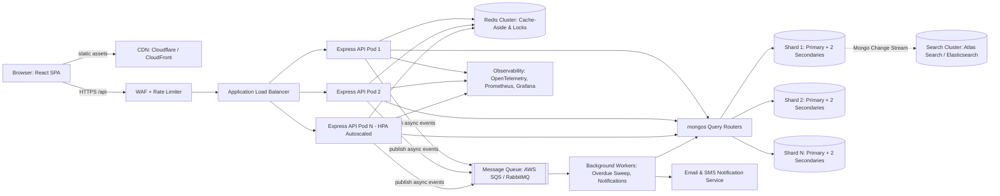

# ShelfLife — System Design Write-Up

## Scale & Capacity Assumptions
- **Scale:** 500 partner libraries, 2,000,000 registered members, catalog size ~5,000,000 book records.
- **Traffic Pattern:** Read operations (catalog search, book details, member lookup) heavily dominate write operations (issue/return book) at an estimated ratio of **25:1 to 40:1**.
- **Seasonal Spikes:** A predictable **10× peak traffic spike** during the first two weeks of academic semesters (fall and spring), driven by book searches and simultaneous syllabus borrow runs.
- **Estimated Throughput:**
  - *Baseline load:* ~150 requests/sec average (~140 reads/sec, ~10 writes/sec).
  - *Semester peak:* ~1,500 requests/sec average, with peak burst spikes up to ~3,000 requests/sec.

---

## (a) High-Level Architecture



### Component Breakdown
1. **Edge CDN (Cloudflare/CloudFront):** Caches production React SPA static assets (JS, CSS, images) and static cover images, shielding the origin.
2. **WAF & Rate Limiter:** Protects public routes against credential stuffing (`/api/auth/login`) and DDoS via token-bucket IP limits.
3. **Application Load Balancer (ALB):** Terminates TLS, runs health checks against `/api/health`, and distributes round-robin traffic across stateless API pods.
4. **Stateless Express API Pods:** Verify JWTs locally (asymmetric RS256 or shared secret), eliminating session stickiness. Any pod can service any request.
5. **Redis Cluster:** Distributed cache-aside store for catalog search results, genre listings, and real-time per-book availability counters.
6. **MongoDB Sharded Cluster:** Comprises `mongos` stateless query routers, config servers, and replica-set shards (each with 1 primary + 2 secondaries) configured with `secondaryPreferred` read preference for read-heavy operations.
7. **Message Queue (AWS SQS / RabbitMQ) & Workers:** Decouples non-critical background jobs (overdue status synchronization, email/SMS reminders, daily library reports) from the synchronous HTTP request path.
8. **Observability Pipeline:** OpenTelemetry collectors, Prometheus metric scrapers, and centralized structured logging with `x-request-id` tracing.

---

## (b) Single Cluster vs. Sharding Strategy

### Decision: Commit to Sharding
While a 3-node replica set suffices up to ~500k records and ~300 req/s, servicing 500 libraries, 2M members, and 5M books under peak bursts requires horizontal data partitioning. We shard the MongoDB cluster to bound working sets within physical RAM and distribute write IOPS.

To enable multi-tenancy across 500 institutions, we introduce a `libraryId: ObjectId` attribute to `Book`, `Member`, and `BorrowRecord`.

### Shard Keys & Justifications

#### 1. `Book` Collection: `{ libraryId: 1, _id: 1 }`
- **Why compound:** `libraryId` alone has low cardinality (500 distinct values), which would create oversized "jumbo chunks" for massive universities. Appending `_id` delivers high cardinality and even chunk distribution.
- **Query targeting:** Over 95% of catalog lookups, search filters, and inventory checks are scoped to a student's specific university (`libraryId`). The `mongos` router directs queries directly to a single shard rather than broadcasting expensive scatter-gather operations.
- **Atomic Stock Isolation:** Because all physical copies of a specific book share the exact same `(libraryId, _id)` tuple, single-document atomic stock decrements (`findOneAndUpdate`) always execute on a single physical shard, guaranteeing atomicity without distributed transaction overhead.

#### 2. `BorrowRecord` Collection: `{ libraryId: 1, member: 1, issueDate: 1 }`
- **Why compound:** Queries for member loan history (`GET /api/members/:id/history`) include `libraryId` and `member`, perfectly targeting a single shard. Including `issueDate` aligns with natural chronological sorting.
- **Trade-off:** Querying "who currently has book X out?" requires filtering by `{ libraryId, book }` without `member`. This executes as a targeted scatter-gather across the chunks owned by that `libraryId` (typically 1–2 shards), which is mitigated by a secondary index on `{ libraryId: 1, book: 1, status: 1 }`.

#### Rejected Alternatives
- **Monotonically increasing keys (`_id` or `createdAt` alone):** All insertions route to the shard holding the max range, creating a severe write hotspot.
- **Hashed `_id` (`{ _id: 'hashed' }`):** Distributes books randomly, but destroys query co-location. Every library catalog search would be forced into a full scatter-gather query across all shards.

---

## (c) Most Read-Heavy Operation & Caching Architecture

### Identification
**Book catalog search and browsing (`GET /api/books?genre=...&search=...&page=...`)** accounts for >80% of incoming traffic during registration and exam periods.

### Caching Strategy (Cache-Aside via Redis)

#### 1. Key Partitioning & Decomposition
We decouple immutable **book metadata** from volatile **book stock availability**:
- **Catalog query results:** `books:{libraryId}:{genre}:{search}:{page}:{limit}:{sort}`
  - Value: Serialized JSON array of book IDs and static attributes (title, author, isbn, genre, totalCopies).
  - TTL: **5 minutes** (+ randomized jitter of ±30 seconds to prevent synchronized expiration).
- **Per-book availability counter:** `avail:{bookId}`
  - TTL: **15 seconds**.
- **Distinct Genres:** `genres:{libraryId}`
  - TTL: **1 hour**.

#### 2. Cache Invalidation
- **On book creation/update:** We increment a version token `catalogVersion:{libraryId}`. All catalog cache keys include this version in their prefix. Incrementing the token instantly invalidates all cached catalog listings for that library without expensive wildcard key scanning.
- **On borrow / return:** Only the volatile `avail:{bookId}` key is deleted or decremented. Catalog query pages remain cached, and API pods dynamically hydrate real-time stock numbers before returning the JSON payload.
- **Safety guarantee:** Issue and return operations **never read from cache**; stock checks always query MongoDB authoritative state.

#### 3. Cache Stampede Protection
When a cache entry for a popular query expires under high concurrency, thousands of simultaneous requests would hit MongoDB. We mitigate this with:
- **Single-Flight / Mutex Locking:** The first API pod detecting a cache miss acquires a Redis mutex lock (`SET books:lock:... PX 3000 NX`) to query MongoDB and populate the cache. Sibling pods wait up to 100ms or serve stale data via **stale-while-revalidate**.
- **Expected Hit Ratio:** >92% during peak semester periods, reducing database read IOPS by an order of magnitude.

---

## (d) Concurrency Control: Zero Overselling at Scale

### Primary Mechanism: Single-Document Atomic Conditional Updates
ShelfLife enforces stock integrity through atomic conditional modification at the database level:
```javascript
const book = await Book.findOneAndUpdate(
  { _id: bookId, availableCopies: { $gt: 0 } },
  { $inc: { availableCopies: -1 } },
  { new: true }
);
```

### Why It Scales Across Pods & Shards
1. **Shard Localization:** Because the `Book` collection is sharded by `{ libraryId: 1, _id: 1 }`, the target document lives entirely on a single primary shard node.
2. **Document-Level Locking:** MongoDB WiredTiger engine uses ticket-based row-level write locks. Concurrent `findOneAndUpdate` requests targeting the same book document are serialized in memory by the primary shard's storage engine. Exactly $N$ requests will find `availableCopies > 0`; the $(N+1)$-th request will evaluate to false, return `null`, and trigger a clean `409 NO_COPIES_AVAILABLE`.

### Comparison with Alternative Concurrency Strategies

| Concurrency Pattern | Latency | Throughput under Contention | Failure Modes & Complexity | Verdict for ShelfLife |
|---|---|---|---|---|
| **Atomic Conditional Update (`$gt: 0`, `$inc: -1`)** | **Lowest (<5ms)** | **High** | None. Handled natively inside database engine. | **CHOSEN: Optimal, robust, minimal overhead** |
| Optimistic Concurrency Control (Version / `@Version`) | Medium | Poor | High abort & retry rate on hot books; wastes CPU and DB cycles. | Rejected for last-copy stampedes |
| Distributed Locks (Redlock / Redis Mutex) | High (+2 network hops) | Moderate | Lock expiration mid-process, GC/clock drift, split-brain failure. | Rejected: adds unneeded infrastructure dependency |
| Partitioned Queue (Single Worker per Book) | High (async queue wait) | High | Introduces eventuality, complex consumer partition rebalancing. | Over-engineered for standard library scale |
| Two-Phase Multi-Document Transactions | High (consensus overhead) | Low | Locks cross multiple collections; prone to write-conflict aborts. | Rejected for happy path; compensation preferred |

### Defense-in-Depth Measures
1. **Schema Check:** Schema-level rule `min: 0` on `availableCopies`.
2. **Partial Unique Index:** Unique constraint on `{ book: 1, member: 1 }` where `status: { $in: ['issued', 'overdue'] }` stops double-issuing to the same member.
3. **Idempotency Keys:** Clients supply an `Idempotency-Key` header stored on `BorrowRecord`; automated network retries do not re-decrement stock.
4. **Daily Reconciliation Worker:** Nightly background job validates that `availableCopies === totalCopies - count(active loans)` and alerts on discrepancies.

---

## (e) Handling 10× Semester Spikes Cost-Effectively

Operating a cluster sized continuously for 1,500 req/s wastes 85% of infrastructure spend across 50 quiet weeks. We apply an elastic, cloud-native scaling strategy:

```
Normal (150 req/s)               Peak Semester (1,500 req/s)
[2 API Pods]                     [15-20 API Pods (HPA)]
[M30 Mongo Tier (1 Primary)]     [M50 Auto-Scaled Tier + Secondary Read Pooling]
[Redis Base 2GB]                 [Redis Cluster 8GB + Pre-warmed Catalog Keys]
```

### Elastic Scaling Architecture
1. **Scheduled Scaling + Reactive HPA:**
   - **Pre-scaling:** Academic semester start dates are known months in advance. We schedule a baseline pod increase (from 2 pods to 12 pods) 24 hours prior to orientation week to eliminate cold-start container spin-up delays.
   - **Horizontal Pod Autoscaling (HPA):** Kubernetes HPA scales API pods reactively between 10 and 25 pods based on target 65% CPU utilization and 200 HTTP req/sec per pod.
2. **Database Elasticity (MongoDB Atlas):**
   - Enable auto-scaling storage and RAM tiers (e.g. M30 baseline scaling up to M50 during semester weeks).
   - Configure Express read preference to `secondaryPreferred` for `GET /api/books`, routing non-transactional browse traffic across two secondary read replicas.
3. **Queue Load Leveling:**
   - Write paths that do not require synchronous student confirmation (audit logs, overdue status sweeps, email notices) are published to AWS SQS and processed by background worker pods throttled to steady rates.
4. **Protective Shedding & Graceful Degradation:**
   - Aggressive WAF rate-limiting on bots and unauthorized scrapers.
   - If DB CPU exceeds 85%, API pods degrade gracefully: non-critical search filters (regex title search) are temporarily restricted, and catalog pages serve cached results with extended 10-minute TTLs.
5. **Pre-Semester Load Testing:**
   - Automated `k6` load scripts simulate 2,000 virtual users running concurrent book searches, issues, and returns to validate p95 latency targets (<150ms) prior to each academic session.

---

## Architectural Decision Matrix

| Architectural Area | Choice | Primary Justification | Key Trade-Off |
|---|---|---|---|
| **Database Architecture** | Sharded MongoDB Cluster with Compound Keys | Prevents memory saturation at 5M books and routes 95% of queries to a single shard | Cross-library queries require scatter-gather |
| **Book Shard Key** | `{ libraryId: 1, _id: 1 }` | Scopes catalog queries to single shards and guarantees atomic single-document updates | Cannot shard cleanly without `libraryId` |
| **Concurrency Control** | Atomic `findOneAndUpdate` with `$inc: -1` | Guarantees zero overselling inside WiredTiger engine without retries or distributed locks | Requires application compensation rollback on subsequent failure |
| **Catalog Performance** | Redis Cache-Aside with Versioned Tag Invalidation | Absorbs 90%+ read traffic during 10× semester spikes | Brief eventual consistency (~15s) on stock visibility |
| **Overdue Tracking** | Real-time `effectiveStatus` derivation + Lazy Sync | Zero lag between actual calendar date and displayed overdue status | Extra lightweight write on member history view |
| **Elasticity Strategy** | Scheduled pre-scaling + HPA + Atlas dynamic tiering | Eliminates 80%+ idle infrastructure costs during non-peak academic periods | Requires operational calendar scheduling before each semester |
